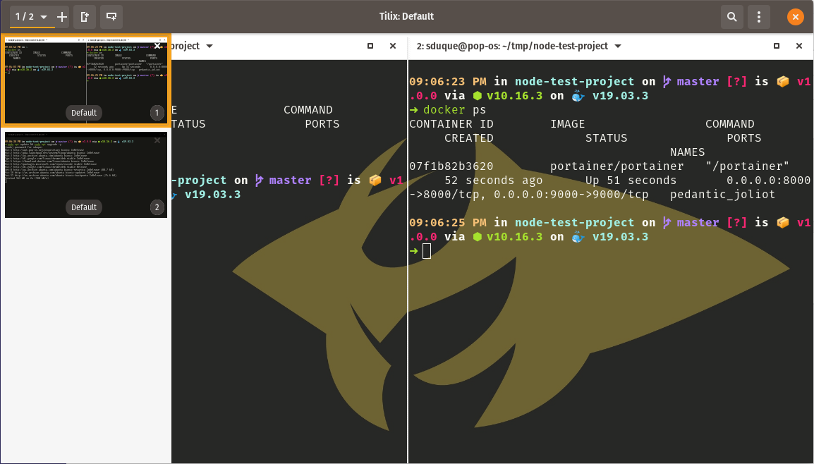
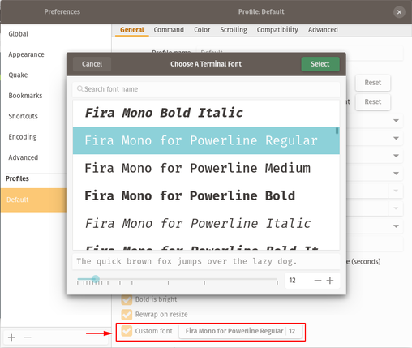
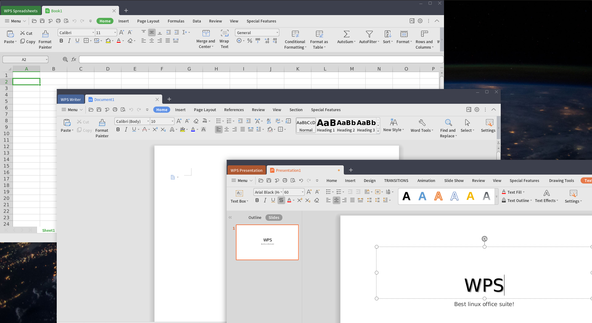
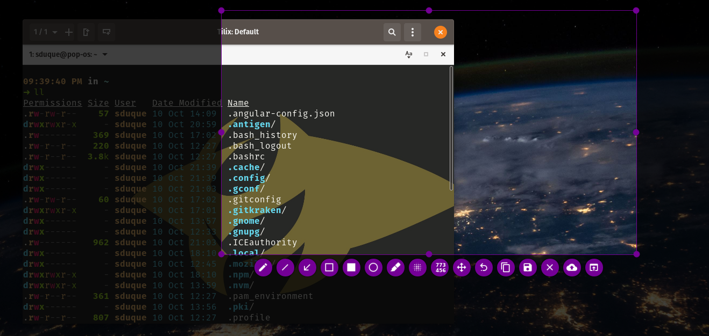
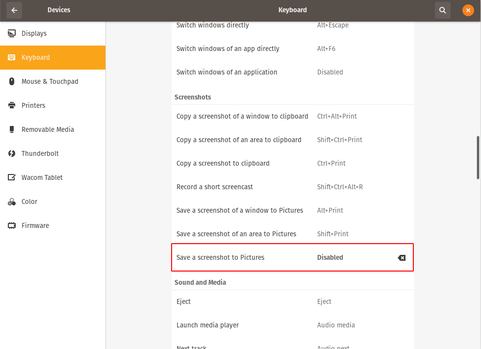
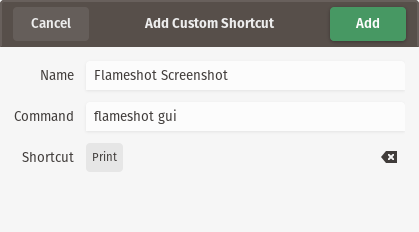

# My Linux 🐧 Setup

My personal Linux configuration and setup

## Hardware

||Laptop 💻|Desktop 🖥️|
|-|-|-|
|CPU|[Intel(R) Core(TM) i7-5500U CPU @ 2.40GHz](https://www.intel.com/content/www/us/en/products/processors/core/i7-processors/i7-5500u.html)|Intel(R) Core(TM) i7 ...|
|Memory|12 GB DDR3|16 GB DDR4|
|Storage|[Samsung Evo 500 GB SSD](https://www.samsung.com/us/computing/memory-storage/solid-state-drives/ssd-860-evo-2-5--sata-iii-500gb-mz-76e500b-am/) + 1 TB HDD|500 GB SSD|
|GPU|[Nvidia GeForce 940M GM108M](https://www.geforce.com/hardware/notebook-gpus/geforce-940m)|[AMD Raedon RX 550](https://www.amd.com/en/products/graphics/radeon-rx-550)|

## Operating System

[<p align="center"></p>](https://system76.com/pop)

### Download

[PopOS! Home](https://system76.com/pop)

### Installation

During PopOS! installation, choose advanced method and click in 'Modify partitions'. This will open GParted, I configured the partitions this way:

|Pop Partition|Name|Label|Format|Size|
|-|-|-|-|-|
|/boot|EFI|boot|FAT32|2 GB (I mess a lot with kernels 😁) ~ 700 MB is recommended|
|swap|N/A|swap|linux-swap|2 x Memory size (24GB for 💻 & 32 GB for 🖥️) |
|/|root|PopOS|EXT4|Rest of the disk space|
|/mnt/DATA (not used in installation)|DATA|DATA|NTFS|The whole second disk (if any)|

Now close GParted and tell the installation wizzard to use those partitions clicking the colored blocks and selecting how is that partition going to be used.

**Note:** Always enable the format option for every partition unless you are not doing a clean installation (and you know what you are doing).

## Terminal

- Default shell: [zsh](https://github.com/zsh-users/zsh)
- Terminal emulator: [Tilix](https://gnunn1.github.io/tilix-web)

### ZSH

With [Oh My ZSH!](https://ohmyz.sh) of course  

#### Installation

```shell
$ sudo apt install zsh
$ chsh -s $(which zsh)
```

#### Plugin manager

[Antigen ⚙️](https://github.com/zsh-users/antigen)

```shell
$ curl -L git.io/antigen > ~/antigen.zsh
$ mkdir -p ~/antigen && mv ~/antigen.zsh ~/antigen
```
#### Theme

[Spaceship Prompt 🚀⭐](https://github.com/denysdovhan/spaceship-prompt)

[<p align="center"></p>](https://github.com/denysdovhan/spaceship-prompt)

#### Configuration file
Clone the [~/.zshrc](https://github.com/sebastiandg7/my-linux-setup/blob/master/.zshrc) file into your home directory.

### Tilix

[<p align="center"></p>](https://gnunn1.github.io/tilix-web)

#### Installation  
```shell
$ sudo apt install tilix
```
### Set as default

Execute

```shell
$ sudo update-alternatives --config x-terminal-emulator
```

And choose the tilix option

```shell
$ sudo update-alternatives --config x-terminal-emulator
[sudo] password for user: 
There are 2 choices for the alternative x-terminal-emulator (providing /usr/bin/x-terminal-emulator).

  Selection    Path                             Priority   Status
------------------------------------------------------------
  0            /usr/bin/gnome-terminal.wrapper   40        auto mode
  1            /usr/bin/gnome-terminal.wrapper   40        manual mode
* 2            /usr/bin/tilix.wrapper            30        manual mode

Press <enter> to keep the current choice[*], or type selection number: 2
```

#### Font

[Fira Mono Regular (Powerline pathced)](https://github.com/sebastiandg7/fonts/tree/master/FiraMono)

[<p align="center"></p>](https://gnunn1.github.io/tilix-web)

**Note**: A powerline patched font is required for spaceship theme special icons to work.

#### Background

[Pokemon Terminal](https://github.com/LazoCoder/Pokemon-Terminal)
[<p align="center"></p>](https://github.com/LazoCoder/Pokemon-Terminal)

##### Installation

```shell
$ sudo apt install python3-pip
$ pip3 install --user git+https://github.com/LazoCoder/Pokemon-Terminal.git
```

##### Usage

```shell
$ pokemon arceus
or
$ ichooseyou lucario
```

⚠️ You need to increase the terminal transparency in the Tilix profile config in order to get the background image to be shown.

### Aliases

- ls replacement: [Exa](https://the.exa.website)
- cat replacement: [Bat 🦇](https://github.com/sharkdp/bat)

### Configuration file

Clone the [~/.zsh_aliases](https://github.com/sebastiandg7/dotfiles/blob/master/.zsh_aliases) file into your home directory.

## Apps & Utilities

### Office suite

[WPS Office 📚](http://wps-community.org) (Best linux office suite!!!)
[<p align="center"></p>](http://wps-community.org)

⚠️ WPS may show you a warning because of some missing fonts. [Here you can install them](https://github.com/IamDH4/ttf-wps-fonts).

### Screenshots

[Flameshot 🔥](https://flameshot.js.org)
[<p align="center"></p>](https://flameshot.js.org)

#### Installation

```shell
$ sudo apt install flameshot
```
#### Setup

Open Settings app and go to Devices > Keyboard. The disable the default screenshot mapping to the **Print** key.

<p align="center"></p>

Then go to the bottom and create a new custom shortcut with the command `flameshot gui` and bind it to the **Print** key:

<p align="center"></p>

Add it and you are done! Every time you hit the **Print** key the flameshot gui tool will start.

## Gnome Desktop

PopOS! uses gnome as default desktop environment, here are some useful tools to make the most out of it 🔥

### Gnome Tweaks

[Gnome Tweaks](https://github.com/GNOME/gnome-tweaks) lets you modify different settings like enabling the minimize and maximize buttons for app windows, changing themes, fonts and many other things...

```shell
$ sudo apt install gnome-tweaks
```

### Gnome Extensions

Gnome Extensions can improve a lot your user experience with the gnome desktop environment. You can install them visiting this web site:

https://extensions.gnome.org

You need to install the gnome shell integration [Chrome extension](https://chrome.google.com/webstore/detail/gnome-shell-integration/gphhapmejobijbbhgpjhcjognlahblep) or [Firefox Add-on](https://addons.mozilla.org/es/firefox/addon/gnome-shell-integration/) to easily (un)install the extensions. Once installed, I suggest to activate the extensions synchronization option to save them in your account.

These are the most useful extensions I have tried:

- [Audio Output Swithcer](https://extensions.gnome.org/extension/751/audio-output-switcher/): Switch audio output device from top menu
- [Caffeine](https://extensions.gnome.org/extension/517/caffeine/): Toggle screen timeout on/off with just a click
- [Clipboard Indicator](https://extensions.gnome.org/extension/779/clipboard-indicator/): Easily access your clipboard history
- [CPU Power Manager](https://extensions.gnome.org/extension/945/cpu-power-manager/): Define and quickly change CPU performance profiles
- [Dash to Dock](https://extensions.gnome.org/extension/307/dash-to-dock/): Get a highly customizable dock for your apps!
- [Lock Keys](https://extensions.gnome.org/extension/36/lock-keys/): Know Capslock & Numslock status in the top bar
- [OpenWeather](https://extensions.gnome.org/extension/750/openweather/): Know your local weather from the top bar
- [Removable Drive Menu](https://extensions.gnome.org/extension/7/removable-drive-menu/): View and eject removable drives as USB or externar disks devices
- [Tray Icons](https://extensions.gnome.org/extension/1503/tray-icons/): Enable tray icons in the top bar. Hello again to slack, teamviewer and similar apps
- [User Themes](https://extensions.gnome.org/extension/19/user-themes/): Enables the option to install and use custom themes in your desktop environment

## Colors

Dark blue:  `#03375C`  
## Bonus

### Easy Docker installation
To easily install [docker](https://www.docker.com/) without messing with ppa repos or legacy docker versions, execute:
```shell
$ curl -o- https://get.docker.com | bash
$ sudo usermod -aG docker $USER
```

### Easy NodeJS installation (NVM)

__**Note:** NVM is automatically installed with the nvm zsh antigen plugin__

[NVM (Node Version Manager)](https://github.com/nvm-sh/nvm) is a command line tool that helps you easy manage multiple node versions in your system.

One of it's main benefits is you don't need to execute global npm commands with root permissions, this is due to it's user scoped node installation. To install NVM and start using it, execute:
```shell
$ curl -o- https://raw.githubusercontent.com/nvm-sh/nvm/v0.35.0/install.sh | bash
$ nvm install 10.16.3 # Install a node version
$ nvm use 10.16.3 # Use a node version
$ npm i -g npm # Execute global npm installation without root permissions 
```

